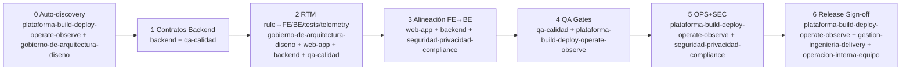

# WF-38 — Verificación de alineación Frontend/Backend (Windsurf) + Release Gate a Producción

> **Skills** desde `.windsurf/skills/*` · **Rules** desde `.windsurf/rules/*` · **Contratos** en `backend-mock/` **frontend** en `bookly-mock-frontend/` **backend** en `bookly-mock/`

## Catálogo de skills (referencia rápida)

> Nombres = **nombre del archivo sin extensión** (ej. `web-app.md` → `web-app`)

- `web-app`
- `backend`
- `qa-calidad`
- `seguridad-privacidad-compliance`
- `plataforma-build-deploy-operate-observe`
- `gobierno-de-arquitectura-diseno` (opcional)
- `arquitectura-escalabilidad-resiliencia` (opcional)
- `gestion-ingenieria-delivery` (opcional)
- `operacion-interna-equipo` (opcional)

---

## Asignación de skills por numeral (obligatorio)

> Cada numeral incluye explícitamente las skills que deben “activarse” al ejecutarlo.

### 0) Auto-discovery (skills/rules/paths)

**Skills:** `plataforma-build-deploy-operate-observe` + `gobierno-de-arquitectura-diseno`  
**Opcional:** `gestion-ingenieria-delivery` (si genera artefactos/reporte)

- 0.1 Resolver skills a usar → `plataforma-build-deploy-operate-observe` + `gobierno-de-arquitectura-diseno`
- 0.2 Indexar rules (`.windsurf/rules/*`) → `gobierno-de-arquitectura-diseno`
- 0.3 Resolver carpetas FE/BE → `plataforma-build-deploy-operate-observe`

**Gate 0**

- Sin `.windsurf/rules/*` o no se resuelven rutas → **NO PASA**

---

### 1) MODEL — Contratos como source of truth (en backend)

**Skills:** `backend` + `qa-calidad`  
**Opcional:** `arquitectura-escalabilidad-resiliencia` (si hay Async/eventos), `gobierno-de-arquitectura-diseno` (para versionado/breaking changes)

- 1.1 Extraer contratos del backend (OpenAPI/AsyncAPI/errors) → `backend`
- 1.2 Validar consistencia contractual (schemas/status/versioning) → `backend` + `qa-calidad`
- 1.3 Definir política de compatibilidad/versionado → `gobierno-de-arquitectura-diseno` (+ `backend`)

**Gate 1**

- FE consume endpoints/eventos sin contrato trazable en backend → **NO PASA**
- Breaking change sin versionado/compatibilidad → **NO PASA**

---

### 2) TRACE — Rule Traceability Matrix (rule → FE/BE/Tests/Telemetry)

**Skills:** `gobierno-de-arquitectura-diseno` + `web-app` + `backend` + `qa-calidad`  
**Opcional:** `plataforma-build-deploy-operate-observe` (si RTM exige telemetría como evidencia)

- 2.1 Construir RTM por `rule_id` → `gobierno-de-arquitectura-diseno`
- 2.2 Mapear evidencia FE (routes/components/i18n) → `web-app`
- 2.3 Mapear evidencia BE (endpoints/events/handlers) → `backend`
- 2.4 Asociar pruebas mínimas por criticidad → `qa-calidad`
- 2.5 Asociar telemetría mínima (logs/traces/metrics) → `plataforma-build-deploy-operate-observe`

**Gate 2**

- Rule sin mapeo FE o sin enforcement BE (cuando aplica a ambos) → **NO PASA**
- Rule crítica sin test mínimo → **NO PASA**

---

### 3) ALIGN — Verificación FE ↔ BE (tipos, errores, auth, estados)

**Skills:** `web-app` + `backend` + `seguridad-privacidad-compliance`  
**Opcional:** `gobierno-de-arquitectura-diseno` (estándares de error codes), `arquitectura-escalabilidad-resiliencia` (si hay realtime/event-driven)

- 3.1 DTOs/Tipos vs contrato BE (drift) → `web-app` + `backend`
- 3.2 Errores BE → mapeo FE → i18n → `web-app` + `backend` (+ `gobierno-de-arquitectura-diseno` si hay catálogo)
- 3.3 AuthN/AuthZ + rate limiting (server-side enforcement) → `seguridad-privacidad-compliance` + `backend`
- 3.4 Eventos/WebSockets alineados (si aplica) → `arquitectura-escalabilidad-resiliencia` + `backend` + `web-app`

**Gate 3**

- Drift FE vs contrato → **NO PASA**
- Acción sensible sin enforcement BE / rate limit donde aplica → **NO PASA**
- Errores no estandarizados/mapeados cuando la rule lo exige → **NO PASA**

---

### 4) QA — Suites y gates (unit/integration/contract/e2e)

**Skills:** `qa-calidad` + `plataforma-build-deploy-operate-observe`  
**Opcional:** `web-app` + `backend` (para arreglar fallos), `operacion-interna-equipo` (datasets/regresión)

- 4.1 Definir pirámide mínima y criticidad → `qa-calidad`
- 4.2 Ejecutar unit/integration/contract → `qa-calidad` + `plataforma-build-deploy-operate-observe`
- 4.3 E2E smoke en staging → `qa-calidad` + `plataforma-build-deploy-operate-observe`
- 4.4 Cobertura por rule_id (rules coverage) → `qa-calidad` (+ `gobierno-de-arquitectura-diseno` si RTM gobierna)

**Gate 4**

- Smoke e2e no corre/falla en staging → **NO PASA**
- Cambios de contrato sin contract tests → **NO PASA**

---

### 5) OPS/SEC — Listo para operar (observabilidad + seguridad)

**Skills:** `plataforma-build-deploy-operate-observe` + `seguridad-privacidad-compliance`  
**Opcional:** `operacion-interna-equipo` (runbooks/guardias), `arquitectura-escalabilidad-resiliencia` (colas/jobs resiliencia)

- 5.1 Observabilidad mínima (logs/traces/metrics + dashboards + alertas) → `plataforma-build-deploy-operate-observe`
- 5.2 Seguridad baseline (SCA/secret scan/CORS/CSP/PII) → `seguridad-privacidad-compliance` + `plataforma-build-deploy-operate-observe`
- 5.3 Resiliencia (timeouts/retries/DLQ/circuit breaker en jobs) si aplica → `arquitectura-escalabilidad-resiliencia` + `plataforma-build-deploy-operate-observe`

**Gate 5**

- No existe camino “alerta → dashboard → trace → log” → **NO PASA**
- Hallazgo bloqueante de seguridad → **NO PASA**

---

### 6) RELEASE — Rollout/Rollback y sign-off

**Skills:** `plataforma-build-deploy-operate-observe` + `gestion-ingenieria-delivery` + `operacion-interna-equipo`  
**Opcional:** `gobierno-de-arquitectura-diseno` (ADRs/decisiones), `qa-calidad` (smoke post-deploy)

- 6.1 Estrategia de despliegue (staging obligatorio + gates) → `plataforma-build-deploy-operate-observe`
- 6.2 Rollout gradual + feature flags + migraciones expand/contract → `plataforma-build-deploy-operate-observe` (+ `gobierno-de-arquitectura-diseno`)
- 6.3 Rollback plan y validación (dry-run) → `plataforma-build-deploy-operate-observe` + `operacion-interna-equipo`
- 6.4 Release Readiness Report (APTO/NO APTO + gaps) → `gestion-ingenieria-delivery` + `operacion-interna-equipo` (+ `qa-calidad`)

**Gate 6**

- Sin rollback claro o flags para cambios críticos → **NO PASA**

---

## Diagrama

