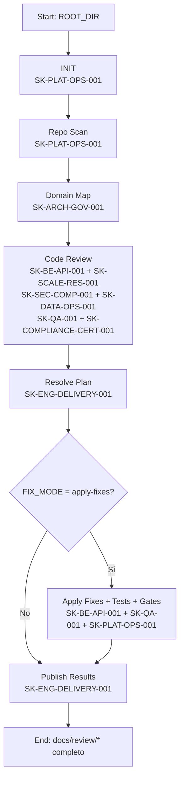

# WF-REV-01 — Windsurf Workflow (con Skills del catálogo): Repo Scan → Review → Resolve Plan → Results (por dominio)

> **Descripción:** Este workflow define un proceso estructurado para auditar repositorios de código. Ejecuta un escaneo completo del repo, clasifica el código por dominios funcionales, realiza code review técnico (arquitectura, seguridad, datos, QA), genera hallazgos priorizados con severidad, produce planes de corrección por dominio y publica resultados consolidados. Asigna Skills específicos del catálogo a cada fase para garantizar expertise especializado en cada área de revisión.

Este workflow define un proceso repetible para:

1. **Analizar un folder/repo** (inventario + organización).
2. Ejecutar **code review por dominio** y registrar hallazgos en `docs/review/`.
3. Generar **plan de corrección por dominio** en `docs/review/relove-plan/`.
4. Publicar **resultados** por dominio en `docs/review/results-resolve-plan/`.

> Nota: se respeta la ruta solicitada `docs/review/relove-plan/` (tal como la escribiste).

---

## Inputs (Windsurf)

- `ROOT_DIR`: ruta del repo (ej. `.`)
- `REVIEW_SCOPE`: `all` o lista de dominios (ej. `AUTH,RSRC,RSRV`)
- `FIX_MODE`: `plan-only` | `apply-fixes` (por defecto: `plan-only`)

---

## Outputs (estructura de artefactos)

```text
docs/review/
  README.md
  _inventory/
    repo-tree.md
    file-index.csv
    nx-projects.md
    dependency-notes.md
  <DOM>/
    findings.md
    evidence.md
docs/review/relove-plan/
  <DOM>/plan.md
docs/review/results-resolve-plan/
  <DOM>/results.md
  summary.md
```

---

## Catálogo de Skills

> Referencia rápida: **nombre (Skill ID)**

- `plataforma-build-deploy-operate-observe` (**SK-PLAT-OPS-001**)
- `gobierno-de-arquitectura-diseno` (**SK-ARCH-GOV-001**)
- `backend` (**SK-BE-API-001**)
- `arquitectura-escalabilidad-resiliencia` (**SK-SCALE-RES-001**)
- `seguridad-privacidad-compliance` (**SK-SEC-COMP-001**)
- `seguridad-avanzada` (**SK-SEC-ADV-001**)
- `qa-calidad` (**SK-QA-001**)
- `operacion-interna-equipo` (**SK-TEAM-OPS-001**)
- `gestion-ingenieria-delivery` (**SK-ENG-DELIVERY-001**)
- `gestion-datos-calidad` (**SK-DATA-OPS-001**)
- `ingenieria-sincronizacion-datos-dificiles` (**SK-SYNC-DATA-001**)
- `cumplimiento-certificaciones` (**SK-COMPLIANCE-CERT-001**)
- `operaciones-soporte-escalamiento` (**SK-OPS-SCALE-001**)
- `web-app` (**SK-WEB-001**) _(condicional: si hay frontend web/admin)_
- `ux-ui` (**SK-UXUI-001**) _(condicional: si hay UI/UX a revisar)_
- `legal-product` (**SK-LEGAL-PRODUCT-001**) _(condicional: si hay T&C/anti-abuso/disclaimers)_
- `data-reporting` (**SK-DATA-001**) _(condicional: si hay pipelines/KPIs/BI operacional)_
- `data-platform` (**SK-DATA-PLAT-001**) _(condicional: si hay warehouse/lakehouse/BI self-serve)_
- `ingenieria-de-producto` (**SK-PROD-EXP-001**) _(condicional: si hay experimentación/flags/A-B)_
- `negocio-gtm-b2b-unificado` (**SK-GTM-B2B-001**) _(condicional: si el review incluye packaging/pricing/lanzamiento)_

---

## Dominios sugeridos (taxonomía base)

- `AUTH` — autenticación, autorización, identidad
- `USER` — perfil/usuarios (si aplica)
- `RSRC` — recursos (salas, auditorios, equipos)
- `RSRV` — disponibilidad y reservas
- `APPR` — aprobaciones / solicitudes
- `RPRT` — reportes y analítica
- `CALN` — calendarios / integración agenda (si aplica)
- `AUDT` — auditoría, trazabilidad, compliance
- `NOTF` — notificaciones (email, websockets, etc.)
- `MTTO` — mantenimiento/ops (scripts, jobs, tooling)
- `CICD` — pipelines, quality gates, deployment

---

# Matriz: tarea → skill executor

| Tarea                                   | Skill executor (principal)                                  | Skills de apoyo (si aplica)                                                            |
| --------------------------------------- | ----------------------------------------------------------- | -------------------------------------------------------------------------------------- |
| Repo scan / inventario                  | `plataforma-build-deploy-operate-observe` (SK-PLAT-OPS-001) | `gestion-ingenieria-delivery` (SK-ENG-DELIVERY-001)                                    |
| Clasificación por dominios              | `gobierno-de-arquitectura-diseno` (SK-ARCH-GOV-001)         | `backend` (SK-BE-API-001)                                                              |
| Review arquitectura/hex/CQRS            | `backend` (SK-BE-API-001)                                   | `gobierno-de-arquitectura-diseno` (SK-ARCH-GOV-001)                                    |
| Review resiliencia/EDA/perf             | `arquitectura-escalabilidad-resiliencia` (SK-SCALE-RES-001) | `plataforma-build-deploy-operate-observe` (SK-PLAT-OPS-001)                            |
| Review seguridad                        | `seguridad-privacidad-compliance` (SK-SEC-COMP-001)         | `seguridad-avanzada` (SK-SEC-ADV-001) + `legal-product` (SK-LEGAL-PRODUCT-001)         |
| Review datos/calidad/sync               | `gestion-datos-calidad` (SK-DATA-OPS-001)                   | `ingenieria-sincronizacion-datos-dificiles` (SK-SYNC-DATA-001)                         |
| Review tests/QA                         | `qa-calidad` (SK-QA-001)                                    | `operacion-interna-equipo` (SK-TEAM-OPS-001)                                           |
| Review compliance/evidencias            | `cumplimiento-certificaciones` (SK-COMPLIANCE-CERT-001)     | `seguridad-privacidad-compliance` (SK-SEC-COMP-001)                                    |
| Plan de corrección                      | `gestion-ingenieria-delivery` (SK-ENG-DELIVERY-001)         | `gobierno-de-arquitectura-diseno` (SK-ARCH-GOV-001)                                    |
| Aplicar fixes (si FIX_MODE=apply-fixes) | `backend` (SK-BE-API-001)                                   | `qa-calidad` (SK-QA-001) + `plataforma-build-deploy-operate-observe` (SK-PLAT-OPS-001) |
| Publicar resultados                     | `gestion-ingenieria-delivery` (SK-ENG-DELIVERY-001)         | `operaciones-soporte-escalamiento` (SK-OPS-SCALE-001)                                  |

---

# Workflow (paso a paso)

## Paso 0 — Preparación de carpetas

**Skill executor:** `plataforma-build-deploy-operate-observe` (**SK-PLAT-OPS-001**)

### Prompt (Windsurf) — `INIT`

```text
[SKILL: plataforma-build-deploy-operate-observe | SK-PLAT-OPS-001]
Objetivo: Inicializar estructura de documentación del review.
Acciones:
1) Crear carpetas:
   - docs/review/_inventory/
   - docs/review/relove-plan/
   - docs/review/results-resolve-plan/
2) Crear docs/review/README.md (vacío con secciones base: Dominios, Inventario, Hallazgos, Planes, Resultados).
Salida:
- Estructura base creada.
```

---

## Paso 1 — Repo Scan (analizar folder)

**Skill executor:** `plataforma-build-deploy-operate-observe` (**SK-PLAT-OPS-001**)  
**Skill de apoyo:** `gestion-ingenieria-delivery` (**SK-ENG-DELIVERY-001**) para formateo/estándar documental.

### Prompt (Windsurf) — `SCAN`

```text
[SKILL: plataforma-build-deploy-operate-observe | SK-PLAT-OPS-001]
Objetivo: Analizar el repositorio en ROOT_DIR y producir un inventario técnico.
Acciones:
1) Identifica estructura de carpetas, apps/libs/infrastructure, configs (nx.json, project.json, tsconfig, package.json, .github).
2) Genera un árbol (hasta 5 niveles) y un índice de archivos (ruta, extensión, tamaño aprox, última modificación si está disponible).
3) Si es NX: lista proyectos, tags, dependencias relevantes.
4) Detecta convenciones (tests, lint, sonar, CI) y “hotspots” (carpetas grandes, duplicación, deuda técnica visible).
Salida:
- docs/review/_inventory/repo-tree.md
- docs/review/_inventory/file-index.csv
- docs/review/_inventory/nx-projects.md (si aplica)
- docs/review/_inventory/dependency-notes.md
No hagas cambios de código todavía.
```

---

## Paso 2 — Domain Classification (mapear dominios)

**Skill executor:** `gobierno-de-arquitectura-diseno` (**SK-ARCH-GOV-001**)  
**Skill de apoyo:** `backend` (**SK-BE-API-001**) para validar límites con el código real.

### Prompt (Windsurf) — `DOMAIN MAP`

```text
[SKILL: gobierno-de-arquitectura-diseno | SK-ARCH-GOV-001]
Objetivo: Construir el mapa de dominios del repo.
Acciones:
1) Define la lista de dominios a usar (AUTH, USER, RSRC, RSRV, APPR, RPRT, CALN, AUDT, NOTF, MTTO, CICD).
2) Crea una tabla “Dominio -> proyectos NX / carpetas / archivos clave”.
3) Identifica “cross-cutting”: common, logging, monitoring, event-bus, dto, infrastructure.
Salida:
- Crea/actualiza docs/review/README.md con:
  - lista de dominios
  - mapa dominio->rutas
  - criterios de clasificación
No modifiques código.
```

---

## Paso 3 — Code Review (hallazgos por dominio)

> Este paso se ejecuta por cada dominio en `REVIEW_SCOPE`.  
> Se divide en sub-tareas para asignar skills con precisión.

### 3.1 Review de Arquitectura / Hexagonal / CQRS

**Skill executor:** `backend` (**SK-BE-API-001**)  
**Apoyo:** `gobierno-de-arquitectura-diseno` (**SK-ARCH-GOV-001**)

### 3.2 Review de EDA, resiliencia, performance, concurrencia

**Skill executor:** `arquitectura-escalabilidad-resiliencia` (**SK-SCALE-RES-001**)  
**Apoyo:** `plataforma-build-deploy-operate-observe` (**SK-PLAT-OPS-001**)

### 3.3 Review de Seguridad, privacidad y controles

**Skill executor:** `seguridad-privacidad-compliance` (**SK-SEC-COMP-001**)  
**Apoyo:** `seguridad-avanzada` (**SK-SEC-ADV-001**)  
**Condicional:** `legal-product` (**SK-LEGAL-PRODUCT-001**) si hay T&C, anti-abuso, suspensión/apelación, disclaimers.

### 3.4 Review de Datos: consistencia, DQ, auditoría, sincronización

**Skill executor:** `gestion-datos-calidad` (**SK-DATA-OPS-001**)  
**Apoyo:** `ingenieria-sincronizacion-datos-dificiles` (**SK-SYNC-DATA-001**) si hay sync, imports, reconciliación, offline.

### 3.5 Review de Tests y estrategia de QA (BDD/TDD, regresiones)

**Skill executor:** `qa-calidad` (**SK-QA-001**)  
**Apoyo:** `operacion-interna-equipo` (**SK-TEAM-OPS-001**) para QA data-driven / invariantes / release governance.

### 3.6 Review de Compliance / evidencias / readiness de auditoría

**Skill executor:** `cumplimiento-certificaciones` (**SK-COMPLIANCE-CERT-001**)  
**Apoyo:** `seguridad-privacidad-compliance` (**SK-SEC-COMP-001**)

### 3.7 Review Frontend (condicional)

**Solo si el repo contiene web/admin/frontend:**

- **Skill executor:** `web-app` (**SK-WEB-001**)
- **Apoyo:** `ux-ui` (**SK-UXUI-001**)

### Prompt (Windsurf) — `REVIEW BY DOMAIN`

```text
[SKILL ROUTING]
- Arquitectura/Hex/CQRS -> backend (SK-BE-API-001) + gobierno-de-arquitectura-diseno (SK-ARCH-GOV-001)
- Resiliencia/EDA/Perf -> arquitectura-escalabilidad-resiliencia (SK-SCALE-RES-001) + plataforma-build-deploy-operate-observe (SK-PLAT-OPS-001)
- Seguridad -> seguridad-privacidad-compliance (SK-SEC-COMP-001) + seguridad-avanzada (SK-SEC-ADV-001)
- Datos/DQ/Sync -> gestion-datos-calidad (SK-DATA-OPS-001) + ingenieria-sincronizacion-datos-dificiles (SK-SYNC-DATA-001)
- QA/Tests -> qa-calidad (SK-QA-001) + operacion-interna-equipo (SK-TEAM-OPS-001)
- Compliance -> cumplimiento-certificaciones (SK-COMPLIANCE-CERT-001)
- Frontend (si aplica) -> web-app (SK-WEB-001) + ux-ui (SK-UXUI-001)

Objetivo: Hacer code review por dominio y escribir hallazgos organizados.
Acciones:
1) Para cada dominio del REVIEW_SCOPE:
   - Recorre rutas mapeadas
   - Identifica issues contra checklist por sub-área (Arquitectura, EDA/Perf, Seguridad, Datos, QA, Compliance, Frontend)
2) Escribe:
   - docs/review/<DOM>/findings.md (lista priorizada)
   - docs/review/<DOM>/evidence.md (evidencia y referencias)
Reglas:
- No arregles nada aún.
- Mantén hallazgos accionables (qué, dónde, por qué, cómo corregir).
- ID de hallazgo: REV-<DOM>-### con severidad BLOCKER/HIGH/MED/LOW.
```

---

## Paso 4 — Resolve Plan (plan de corrección por dominio)

**Skill executor:** `gestion-ingenieria-delivery` (**SK-ENG-DELIVERY-001**)  
**Apoyo:** `gobierno-de-arquitectura-diseno` (**SK-ARCH-GOV-001**) para decisiones/ADRs si hay cambios estructurales.

### Prompt (Windsurf) — `PLAN`

```text
[SKILL: gestion-ingenieria-delivery | SK-ENG-DELIVERY-001]
Objetivo: Convertir hallazgos del dominio en un plan ejecutable.
Acciones:
1) Lee docs/review/<DOM>/findings.md
2) Crea docs/review/relove-plan/<DOM>/plan.md con:
   - fases (quick wins, correctness/security, refactors)
   - tareas atómicas con criterios de aceptación y DoD
   - dependencias y orden recomendado
   - pruebas a ejecutar por tarea
Reglas:
- Cada tarea debe referenciar al menos un hallazgo REV-<DOM>-###.
- Prioriza seguridad/correctness antes que refactors.
- Si se requiere decisión de arquitectura, agrega ADR pendiente y asigna a gobierno-de-arquitectura-diseno (SK-ARCH-GOV-001).
```

---

## Paso 5 — Apply Fixes (opcional) + Quality Gates + registro

> Solo si `FIX_MODE=apply-fixes`.

### 5.1 Implementación de fixes

**Skill executor:** `backend` (**SK-BE-API-001**)  
**Apoyo (según hallazgos):**

- `arquitectura-escalabilidad-resiliencia` (**SK-SCALE-RES-001**) si hay cambios de EDA/perf/concurrencia.
- `seguridad-avanzada` (**SK-SEC-ADV-001**) si hay hardening/iam/crypto/secret mgmt.
- `gestion-datos-calidad` (**SK-DATA-OPS-001**) si hay migraciones/consistencia de datos.

### 5.2 Pruebas (BDD/TDD + regresión)

**Skill executor:** `qa-calidad` (**SK-QA-001**)  
**Apoyo:** `operacion-interna-equipo` (**SK-TEAM-OPS-001**) (datasets, invariantes, release governance).

### 5.3 CI/CD + Observabilidad + Quality Gates

**Skill executor:** `plataforma-build-deploy-operate-observe` (**SK-PLAT-OPS-001**)  
**Apoyo:** `cumplimiento-certificaciones` (**SK-COMPLIANCE-CERT-001**) para evidencia auditable (Sonar/quality reports).

### Prompt (Windsurf) — `APPLY` (opcional)

```text
[SKILL ROUTING]
- Implementar fixes -> backend (SK-BE-API-001)
- Tests -> qa-calidad (SK-QA-001) + operacion-interna-equipo (SK-TEAM-OPS-001)
- CI/CD + gates + observability -> plataforma-build-deploy-operate-observe (SK-PLAT-OPS-001)
- Evidencias de auditoría -> cumplimiento-certificaciones (SK-COMPLIANCE-CERT-001)

Objetivo: Ejecutar el plan de corrección por dominio y registrar cambios.
Precondición: Existe docs/review/relove-plan/<DOM>/plan.md
Acciones:
1) Implementa tareas de Fase 1 y Fase 2 (sin mezclar dominios en el mismo PR).
2) Agrega/ajusta tests BDD (Given-When-Then) donde aplique.
3) Corre quality gate:
   - lint
   - unit/integration tests
   - (si aplica) sonar/quality checks
4) Actualiza docs/review/results-resolve-plan/<DOM>/results.md con:
   - qué se corrigió
   - PRs/commits (si los tienes)
   - tests ejecutados y resultados
   - riesgos pendientes
Reglas:
- No rompas contratos/eventos sin versionado.
- Si una tarea se bloquea, registra el bloqueo en results.md.
```

---

## Paso 6 — Present Results (documento final por dominio + resumen)

**Skill executor:** `gestion-ingenieria-delivery` (**SK-ENG-DELIVERY-001**)  
**Apoyo:** `operaciones-soporte-escalamiento` (**SK-OPS-SCALE-001**) si se requieren notas operativas/runbooks para soporte.

### Prompt (Windsurf) — `RESULTS`

```text
[SKILL: gestion-ingenieria-delivery | SK-ENG-DELIVERY-001]
Objetivo: Publicar resultados finales por dominio y un resumen general.
Acciones:
1) Para cada dominio:
   - Genera/actualiza docs/review/results-resolve-plan/<DOM>/results.md
   - Incluye: Hallazgos -> Estado (Fixed/Partial/Deferred), evidencia, tests, notas.
2) Genera docs/review/results-resolve-plan/summary.md consolidando todo.
Reglas:
- Mantén el índice y links navegables desde docs/review/README.md.
- Si hay cambios operativos (SLOs/runbooks/alertas), anexa sección “Ops Notes” y asigna apoyo a SK-OPS-SCALE-001.
```

---

## Diagrama (Mermaid) del workflow



---

## DoD (Definition of Done)

El workflow se considera **completo** cuando:

- Existe `docs/review/_inventory/*` (inventario)
- Existe `docs/review/README.md` con mapa dominio→rutas
- Para cada dominio en scope:
  - `docs/review/<DOM>/findings.md` y `evidence.md`
  - `docs/review/relove-plan/<DOM>/plan.md`
  - `docs/review/results-resolve-plan/<DOM>/results.md`
- Existe `docs/review/results-resolve-plan/summary.md`

---

## Routing condicional (para no sobreejecutar skills)

Ejecuta estos skills **solo si el repo lo requiere**:

- `web-app` (SK-WEB-001) + `ux-ui` (SK-UXUI-001): si hay `apps/web`, `admin`, `frontend`, `ui`, etc.
- `data-reporting` (SK-DATA-001): si hay ETLs/pipelines, KPIs, módulos de reporting operacional.
- `data-platform` (SK-DATA-PLAT-001): si hay warehouse/lakehouse, capa semántica, BI self-serve.
- `ingenieria-de-producto` (SK-PROD-EXP-001): si hay feature flags, A/B testing, instrumentación experimental.
- `negocio-gtm-b2b-unificado` (SK-GTM-B2B-001): si el review incluye empaquetado, pricing, plan de lanzamiento.
- `legal-product` (SK-LEGAL-PRODUCT-001): si hay políticas anti-abuso, suspensión/apelación, T&C, disclaimers.
