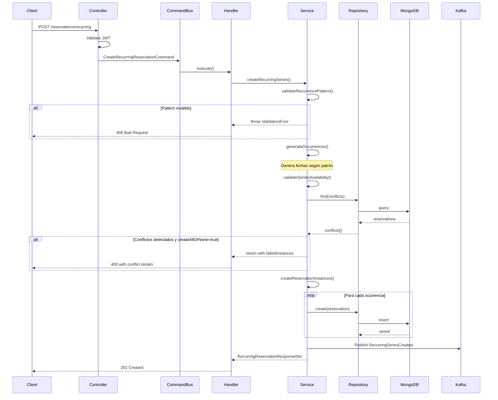
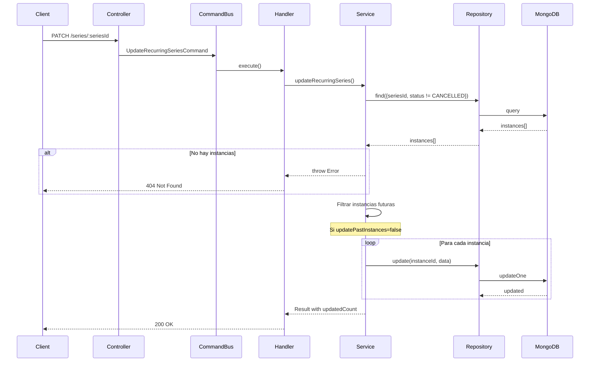
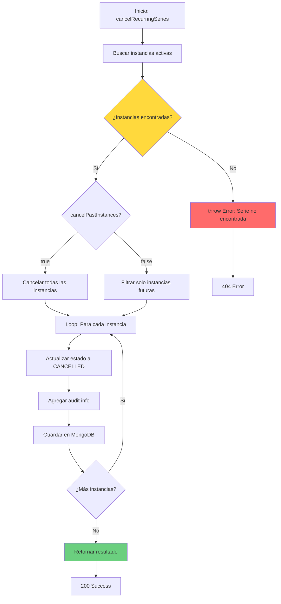
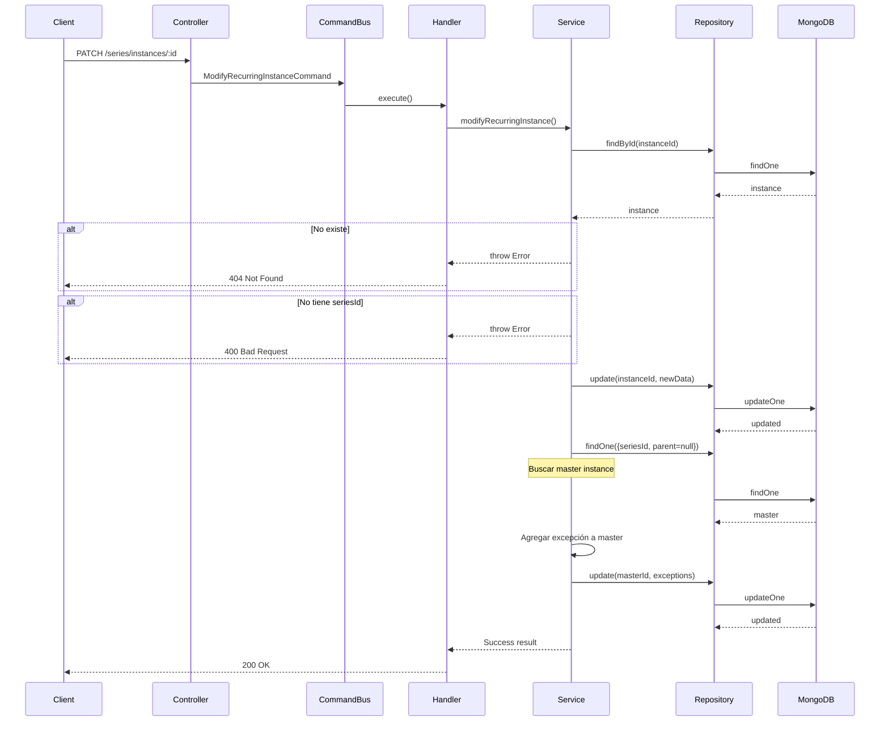
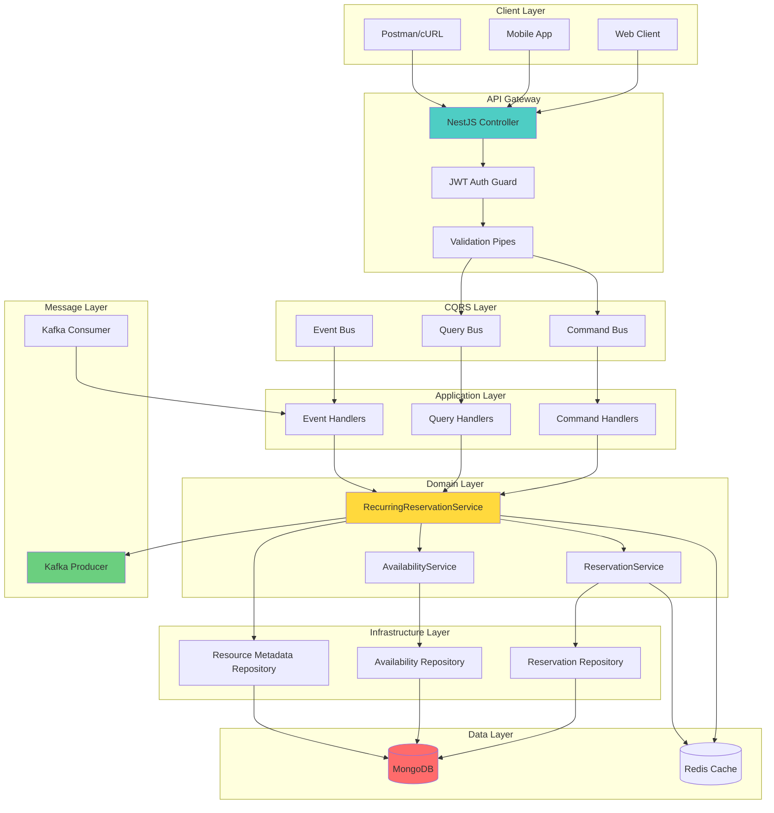
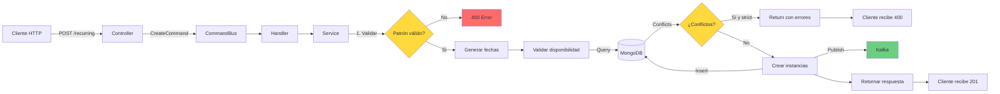
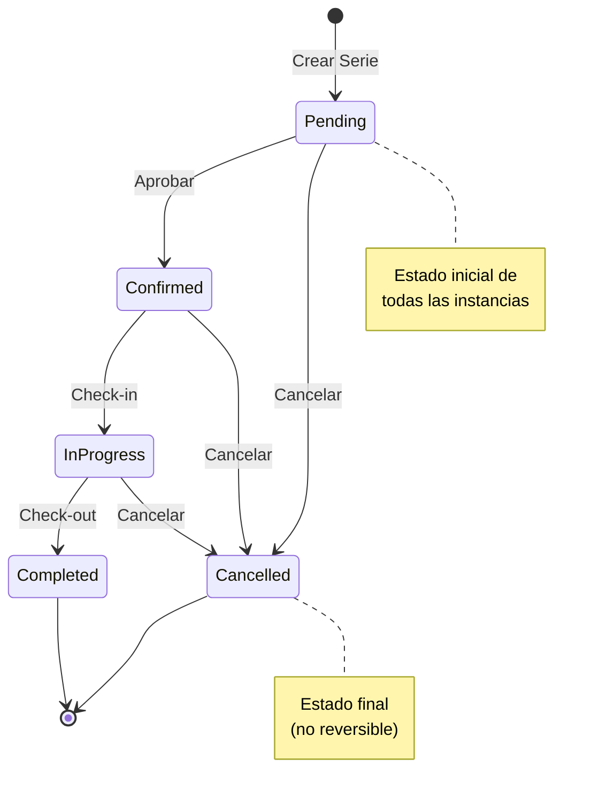
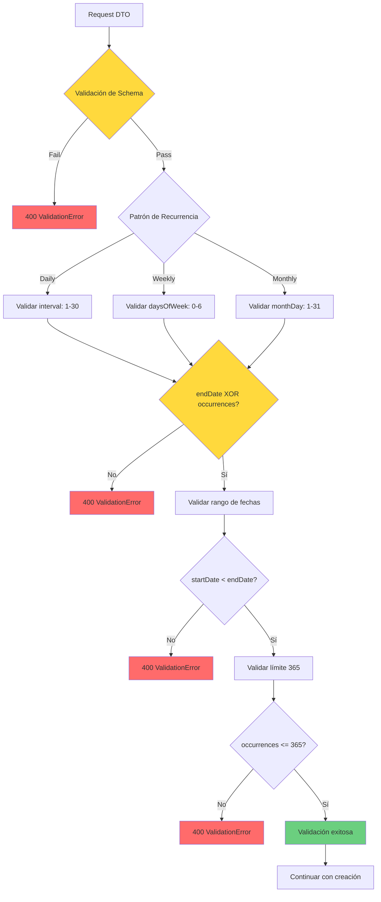
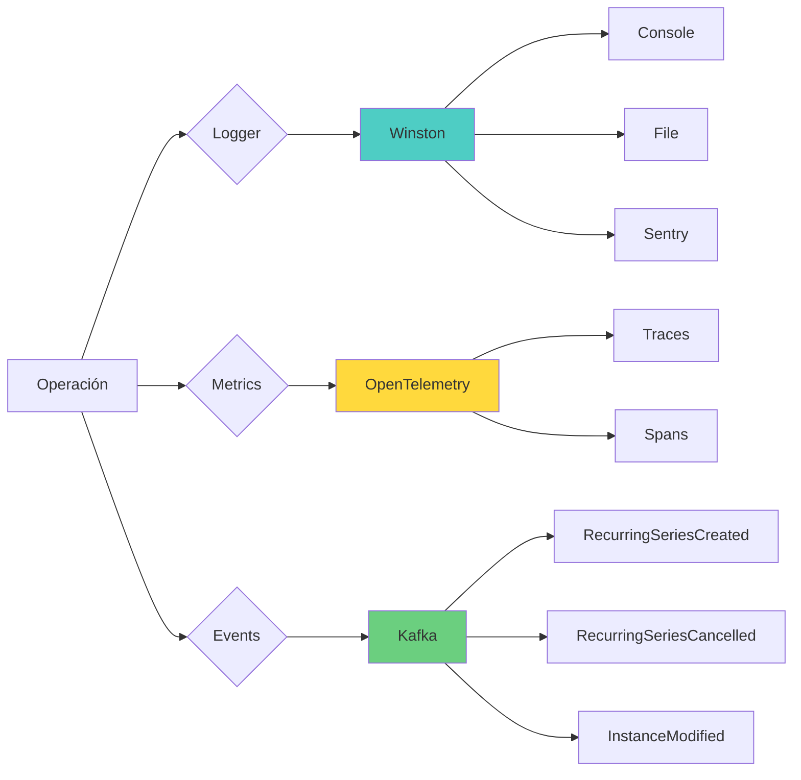
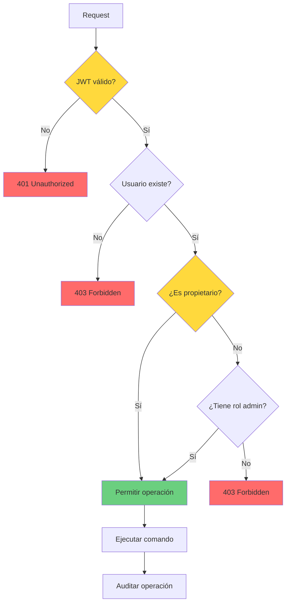

# RF-12: Diagramas de Flujo - Reservas Recurrentes

**Fecha**: 2025-01-04  
**Servicio**: `availability-service`  
**Versión**: 1.0

---

## 📋 Tabla de Contenidos

1. [Crear Serie Recurrente](#crear-serie-recurrente)
2. [Validar Disponibilidad de Serie](#validar-disponibilidad-de-serie)
3. [Generar Ocurrencias](#generar-ocurrencias)
4. [Actualizar Serie Completa](#actualizar-serie-completa)
5. [Cancelar Serie](#cancelar-serie)
6. [Modificar Instancia Individual](#modificar-instancia-individual)
7. [Arquitectura General](#arquitectura-general)

---

## 🔄 Diagramas de Flujo

### 1. Crear Serie Recurrente



---

### 2. Validar Disponibilidad de Serie

```mermaid
flowchart TD
    A[Inicio: validateSeriesAvailability] --> B[Inicializar conflicts array]
    B --> C{Para cada ocurrencia}

    C -->|Siguiente| D[Buscar reservas en MongoDB]
    D --> E{¿Hay conflictos?}

    E -->|Sí| F[Agregar a conflicts con detalles]
    E -->|No| G[Ocurrencia válida]

    F --> H{¿Más ocurrencias?}
    G --> H

    H -->|Sí| C
    H -->|No| I{¿conflicts.length > 0?}

    I -->|Sí| J[Retornar FailedInstanceDto[]]
    I -->|No| K[Retornar array vacío]

    J --> L[Fin]
    K --> L

    style E fill:#ff6b6b
    style I fill:#ffd93d
    style K fill:#6bcf7f
```

---

### 3. Generar Ocurrencias

```mermaid
flowchart TD
    A[Inicio: generateOccurrences] --> B[Validar patrón]
    B --> C{Tipo de frecuencia}

    C -->|Daily| D[Calcular ocurrencias diarias]
    C -->|Weekly| E[Calcular ocurrencias semanales]
    C -->|Monthly| F[Calcular ocurrencias mensuales]

    D --> G[Agregar interval días]
    E --> H[Filtrar por daysOfWeek]
    F --> I[Establecer día del mes]

    G --> J{¿endDate o occurrences?}
    H --> J
    I --> J

    J -->|endDate| K[Generar hasta endDate]
    J -->|occurrences| L[Generar N ocurrencias]

    K --> M{¿Alcanzó límite de 365?}
    L --> M

    M -->|Sí| N[Truncar a 365]
    M -->|No| O[Mantener todas]

    N --> P[Retornar Date[]]
    O --> P

    style B fill:#4ecdc4
    style C fill:#ffd93d
    style M fill:#ff6b6b
    style P fill:#6bcf7f
```

---

### 4. Actualizar Serie Completa



---

### 5. Cancelar Serie



---

### 6. Modificar Instancia Individual



---

### 7. Arquitectura General



---

## 🔄 Flujo de Datos: Crear Serie Recurrente



---

## 📊 Modelo de Estados



---

## 🔍 Proceso de Validación



---

## 🎯 Decisiones de Diseño

### 1. Generación de Instancias

**Decisión**: Generar todas las instancias al crear la serie.

**Alternativas consideradas**:

- Generación lazy (on-demand)
- Generación por lotes

**Ventajas**:

- ✅ Validación de disponibilidad completa
- ✅ Visualización inmediata del calendario
- ✅ Detección temprana de conflictos
- ✅ Simplicidad en consultas

**Desventajas**:

- ❌ Mayor uso de almacenamiento
- ❌ Tiempo de creación más largo

### 2. Manejo de Excepciones

**Decisión**: Almacenar excepciones en array dentro de la instancia master.

**Alternativas consideradas**:

- Colección separada de excepciones
- Flag booleano en cada instancia

**Ventajas**:

- ✅ Consulta rápida de excepciones
- ✅ Historial completo en un solo documento
- ✅ Fácil sincronización

### 3. Modo createAllOrNone

**Decisión**: Permitir modo estricto opcional.

**Razón**: Balance entre flexibilidad y consistencia.

**Comportamiento**:

- `createAllOrNone=true`: Falla si hay conflictos
- `createAllOrNone=false`: Crea instancias válidas y reporta conflictos

---

## 📈 Métricas y Observabilidad



---

## 🔐 Seguridad y Autorización



---

**Última Actualización**: 2025-01-04  
**Versión**: 1.0  
**Herramienta**: Mermaid Diagrams
