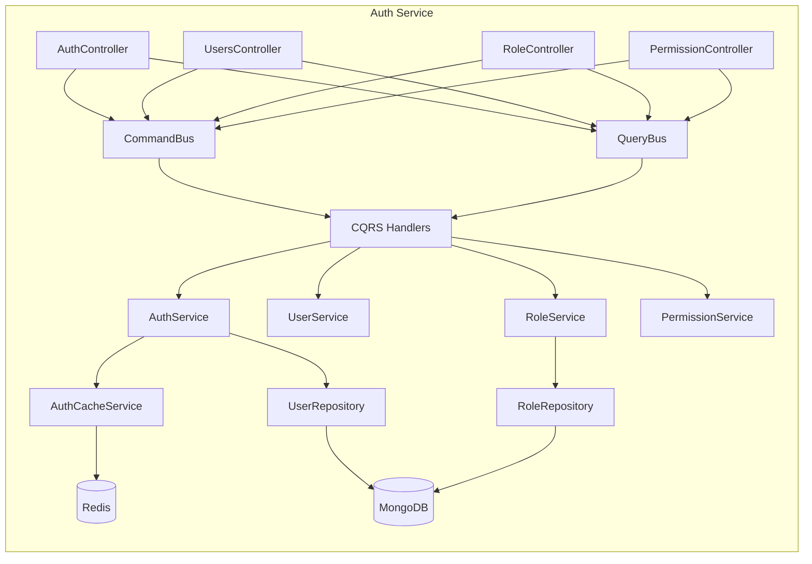
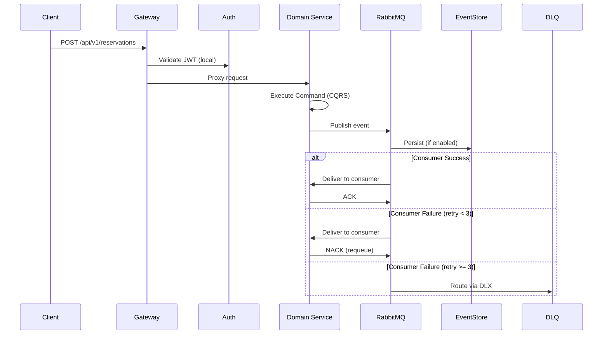
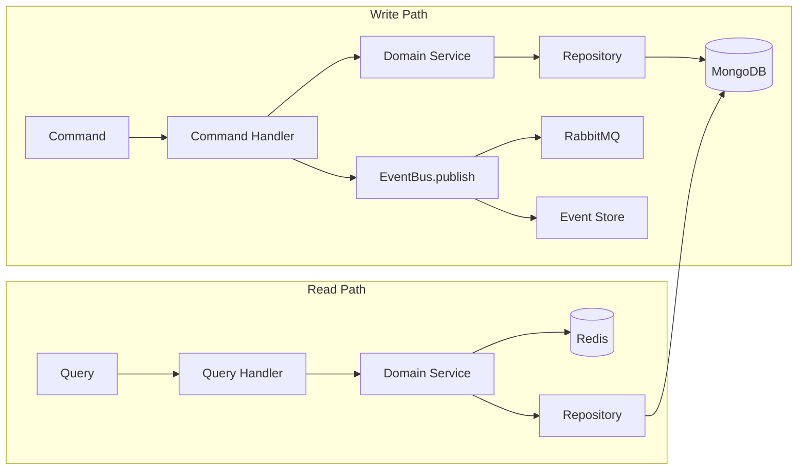

# Bookly Mock — Architecture (C4 Model)

## Level 1: System Context

```mermaid
graph TB
    User[👤 University User<br/>Student/Teacher/Admin]
    Frontend[📱 bookly-web<br/>Next.js Frontend]
    Gateway[🌐 API Gateway<br/>:3000]
    Auth[🔐 Auth Service<br/>:3001]
    Resources[📦 Resources Service<br/>:3002]
    Availability[📅 Availability Service<br/>:3003]
    Stockpile[✅ Stockpile Service<br/>:3004]
    Reports[📊 Reports Service<br/>:3005]
    MongoDB[(MongoDB Atlas)]
    Redis[(Redis Cloud)]
    RabbitMQ[🐰 RabbitMQ<br/>CloudAMQP]

    User --> Frontend
    Frontend --> Gateway
    Gateway --> Auth
    Gateway --> Resources
    Gateway --> Availability
    Gateway --> Stockpile
    Gateway --> Reports

    Auth --> MongoDB
    Resources --> MongoDB
    Availability --> MongoDB
    Stockpile --> MongoDB
    Reports --> MongoDB

    Auth --> Redis
    Resources --> Redis
    Availability --> Redis
    Stockpile --> Redis
    Gateway --> Redis

    Auth --> RabbitMQ
    Resources --> RabbitMQ
    Availability --> RabbitMQ
    Stockpile --> RabbitMQ
    Reports --> RabbitMQ
```

## Level 2: Container Diagram

### Services Overview

| Service                  | Domain              | Key Responsibilities                                                                                  |
| ------------------------ | ------------------- | ----------------------------------------------------------------------------------------------------- |
| **api-gateway**          | Infrastructure      | Routing, rate limiting, circuit breaker, WebSocket, DLQ admin, file manager, webhook dashboard        |
| **auth-service**         | Identity & Access   | Users, roles, permissions, JWT, OAuth/SSO, 2FA, token introspection, permission evaluation, AppConfig |
| **resources-service**    | Resource Management | Rooms, labs, equipment, categories, maintenance, import, faculties/departments/programs               |
| **availability-service** | Scheduling          | Reservations, availability slots, calendar, waiting lists, recurring bookings, reassignments          |
| **stockpile-service**    | Approval Workflows  | Approval requests/flows, check-in/out, notifications, monitoring, QR codes                            |
| **reports-service**      | Analytics & Audit   | Dashboards, usage/demand reports, evaluations, feedback, exports, audit events                        |

### Shared Libraries

| Library               | Purpose                                                   |
| --------------------- | --------------------------------------------------------- |
| `@libs/common`        | Interfaces, ResponseUtil, constants, enums, decorators    |
| `@libs/event-bus`     | EventBusService (RabbitMQ), EventStoreService, DLQService |
| `@libs/redis`         | RedisModule + RedisService                                |
| `@libs/database`      | DatabaseModule (Mongoose), ReferenceDataModule            |
| `@libs/security`      | AuthClientModule + AuthClientService (centralized auth)   |
| `@libs/guards`        | JwtAuthGuard, RolesGuard, PermissionsGuard                |
| `@libs/decorators`    | @Roles, @Permissions, @CurrentUser                        |
| `@libs/idempotency`   | IdempotencyService, CorrelationService, middleware        |
| `@libs/notifications` | Email, SMS, WhatsApp, Push, Webhooks                      |
| `@libs/storage`       | StorageModule (Local/S3/GCS)                              |

## Level 3: Component Detail — Auth Service

## Event Flow

## Data Flow

---

**Last updated**: February 17, 2026
