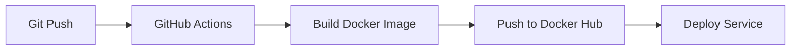

# 📖 Migración de podman-compose.microservices.yml a GitHub Actions

## 🎯 Objetivo

Reemplazar el archivo `podman-compose.microservices.yml` con workflows de GitHub Actions para que el despliegue de cada servicio se ejecute automáticamente cuando la imagen Docker sea actualizada.

## 📋 Tabla de Comparación

### Antes: podman-compose.microservices.yml

| Servicio | Configuración Manual |
|----------|---------------------|
| api-gateway | Build y deploy manual con podman-compose |
| auth-service | Build y deploy manual con podman-compose |
| resources-service | Build y deploy manual con podman-compose |
| availability-service | Build y deploy manual con podman-compose |
| stockpile-service | Build y deploy manual con podman-compose |
| reports-service | Build y deploy manual con podman-compose |
| bookly-web | Build y deploy manual con podman-compose |

**Proceso anterior:**
```bash
# Construcción manual
podman-compose -f podman-compose.microservices.yml build

# Despliegue manual
podman-compose -f podman-compose.microservices.yml up -d
```

### Después: GitHub Actions Workflows

| Servicio | Workflow | Trigger |
|----------|----------|---------|
| api-gateway | `.github/workflows/api-gateway.yml` | Cambios en `bookly-mock/apps/api-gateway/**` |
| auth-service | `.github/workflows/auth-service.yml` | Cambios en `bookly-mock/apps/auth-service/**` |
| resources-service | `.github/workflows/resources-service.yml` | Cambios en `bookly-mock/apps/resources-service/**` |
| availability-service | `.github/workflows/availability-service.yml` | Cambios en `bookly-mock/apps/availability-service/**` |
| stockpile-service | `.github/workflows/stockpile-service.yml` | Cambios en `bookly-mock/apps/stockpile-service/**` |
| reports-service | `.github/workflows/reports-service.yml` | Cambios en `bookly-mock/apps/reports-service/**` |
| bookly-web | `.github/workflows/frontend.yml` | Cambios en `bookly-mock-frontend/**` |

**Proceso automático:**
```bash
# 1. Desarrollador hace cambios en el código
git add .
git commit -m "feat: nueva funcionalidad en api-gateway"
git push origin main

# 2. GitHub Actions se ejecuta automáticamente:
#    - Construye la imagen Docker
#    - Publica en Docker Hub
#    - Despliega el servicio
```

## 🔄 Flujo de Trabajo Nuevo

### 1. Desarrollo Local

```bash
# Trabajo normal en el código
cd bookly-mock/apps/api-gateway
# ... hacer cambios ...

# Commit y push
git add .
git commit -m "feat: nueva funcionalidad"
git push origin develop
```

### 2. CI/CD Automático



1. **Detección de cambios**: GitHub Actions detecta cambios en los archivos relevantes
2. **Build automático**: Construye la imagen Docker usando el Dockerfile correspondiente
3. **Push a Docker Hub**: Publica la imagen con tags automáticos
4. **Deploy**: Despliega el servicio (configurable según tu infraestructura)

### 3. Verificación

```bash
# Ver el estado del workflow en GitHub
# https://github.com/HenderOrlando/booklyapp/actions

# Verificar la imagen en Docker Hub
docker pull <tu-usuario>/bookly-api-gateway:latest
```

## 🆚 Comparación Detallada

### Mapeo de Servicios

#### API Gateway

**Antes (podman-compose.microservices.yml):**
```yaml
api-gateway:
  build:
    context: .
    dockerfile: ../ci-cd/bookly-mock/dockerfiles/Dockerfile.gateway
  container_name: bookly-api-gateway
  ports:
    - "${PORT_0}:3000"
  env_file:
    - ./apps/api-gateway/.env
  networks:
    - bookly-network
  restart: unless-stopped
```

**Después (GitHub Actions - .github/workflows/api-gateway.yml):**
```yaml
on:
  push:
    paths:
      - 'bookly-mock/apps/api-gateway/**'
      - 'ci-cd/bookly-mock/dockerfiles/Dockerfile.gateway'

jobs:
  build:
    uses: ./.github/workflows/build-and-push-image.yml
    with:
      dockerfile-path: ci-cd/bookly-mock/dockerfiles/Dockerfile.gateway
      context-path: bookly-mock
      image-name: bookly-api-gateway
  
  deploy:
    needs: build
    # Configuración de despliegue personalizada
```

#### Auth Service

**Antes:**
```yaml
auth-service:
  build:
    context: .
    dockerfile: ../ci-cd/bookly-mock/dockerfiles/Dockerfile.auth
```

**Después:**
```yaml
# .github/workflows/auth-service.yml
# Workflow automático que se activa con cambios en bookly-mock/apps/auth-service/**
```

*Similar para todos los demás servicios...*

## ✅ Ventajas del Nuevo Enfoque

| Aspecto | podman-compose | GitHub Actions |
|---------|----------------|----------------|
| **Automatización** | Manual | Automático |
| **CI/CD** | No integrado | Totalmente integrado |
| **Versionado** | Manual | Tags automáticos |
| **Trazabilidad** | Limitada | Completa en GitHub |
| **Despliegue Independiente** | Todos a la vez | Por servicio |
| **Rollback** | Manual | Fácil con tags |
| **Notificaciones** | No | Sí (GitHub) |
| **Estado** | Local | Visible en GitHub |

## 🚀 Configuración Necesaria

### 1. Secrets de GitHub

Configura estos secrets en tu repositorio:

```
Settings > Secrets and variables > Actions > New repository secret
```

- `DOCKER_USERNAME`: Tu usuario de Docker Hub
- `DOCKER_PASSWORD`: Token de acceso de Docker Hub

### 2. Permisos de Workflow

Asegúrate de que los workflows tengan permisos:

```
Settings > Actions > General > Workflow permissions
> Read and write permissions
```

### 3. Actualizar .gitignore

El `.gitignore` ha sido actualizado para permitir workflows:

```gitignore
# Antes (workflows ignorados)
.github/workflows/

# Después (workflows permitidos)
# .github/workflows/
```

## 📝 Comandos Equivalentes

### Construir todos los servicios

**Antes:**
```bash
podman-compose -f podman-compose.microservices.yml build
```

**Después:**
```bash
# Automático en cada push, o manual desde GitHub Actions UI
# También puedes usar: gh workflow run <workflow-name>
```

### Iniciar todos los servicios

**Antes:**
```bash
podman-compose -f podman-compose.microservices.yml up -d
```

**Después:**
```bash
# El despliegue se ejecuta automáticamente después del build
# O configura tu plataforma de despliegue en la sección 'deploy' de cada workflow
```

### Ver logs

**Antes:**
```bash
podman-compose -f podman-compose.microservices.yml logs -f api-gateway
```

**Después:**
```bash
# Ver logs del workflow en GitHub Actions
# O logs del servicio desplegado en tu plataforma
```

### Detener servicios

**Antes:**
```bash
podman-compose -f podman-compose.microservices.yml down
```

**Después:**
```bash
# Depende de tu plataforma de despliegue
# Ejemplo Kubernetes: kubectl delete deployment api-gateway
```

## 🔧 Personalización del Deploy

Cada workflow tiene una sección de `deploy` que puedes personalizar según tu infraestructura:

### Opción 1: Kubernetes

```yaml
deploy:
  steps:
    - name: Deploy to K8s
      run: |
        kubectl set image deployment/api-gateway \
          api-gateway=${{ secrets.DOCKER_USERNAME }}/bookly-api-gateway:${{ github.sha }}
```

### Opción 2: Docker Swarm

```yaml
deploy:
  steps:
    - name: Deploy to Swarm
      run: |
        docker service update --image ${{ secrets.DOCKER_USERNAME }}/bookly-api-gateway:latest api-gateway
```

### Opción 3: SSH a servidor remoto

```yaml
deploy:
  steps:
    - name: Deploy via SSH
      uses: appleboy/ssh-action@master
      with:
        host: ${{ secrets.SERVER_HOST }}
        username: ${{ secrets.SERVER_USER }}
        key: ${{ secrets.SSH_PRIVATE_KEY }}
        script: |
          docker pull ${{ secrets.DOCKER_USERNAME }}/bookly-api-gateway:latest
          docker-compose up -d api-gateway
```

## 🎓 Próximos Pasos

1. **Configurar Secrets**: Añadir `DOCKER_USERNAME` y `DOCKER_PASSWORD` en GitHub
2. **Probar Workflows**: Hacer un cambio pequeño y verificar que el workflow funciona
3. **Configurar Deploy**: Personalizar la sección de deploy según tu infraestructura
4. **Deprecar podman-compose**: Mantener el archivo como referencia pero usar GitHub Actions
5. **Monitorear**: Revisar logs y estado de workflows en GitHub Actions

## 📚 Recursos Adicionales

- [Documentación de GitHub Actions](https://docs.github.com/en/actions)
- [README de Workflows](.github/workflows/README.md)
- [Docker Build Push Action](https://github.com/docker/build-push-action)

## ❓ FAQ

### ¿Puedo seguir usando podman-compose localmente?

Sí, puedes mantener `podman-compose.microservices.yml` para desarrollo local. Los workflows son para CI/CD.

### ¿Qué pasa si un workflow falla?

GitHub te notificará por email. Puedes ver los logs en la pestaña Actions y corregir el problema.

### ¿Puedo ejecutar workflows manualmente?

Sí, todos los workflows tienen `workflow_dispatch` que permite ejecución manual desde GitHub UI.

### ¿Cómo hago rollback?

Usa un tag anterior de Docker Hub en tu plataforma de despliegue:
```bash
kubectl set image deployment/api-gateway api-gateway=usuario/bookly-api-gateway:v1.0.0
```

---

**Fecha de migración**: Diciembre 17, 2024
**Estado**: ✅ Migración completada
