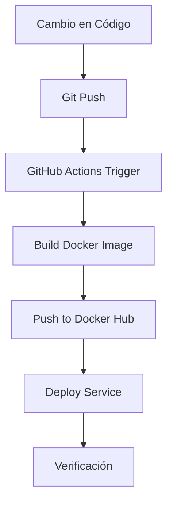

# 📦 Resumen de la Migración a GitHub Actions

## 🎯 Objetivo Completado

Se ha reemplazado exitosamente el archivo `podman-compose.microservices.yml` con workflows de GitHub Actions que automatizan el build y deploy de cada microservicio cuando su imagen Docker es actualizada.

## 📁 Archivos Creados

### Workflows de GitHub Actions (`.github/workflows/`)

1. **build-and-push-image.yml** - Workflow reutilizable base
   - Construye imágenes Docker
   - Publica en Docker Hub
   - Genera tags automáticos
   - Usa cache para optimizar builds

2. **Workflows por Servicio:**
   - `api-gateway.yml` - API Gateway
   - `auth-service.yml` - Servicio de Autenticación
   - `resources-service.yml` - Servicio de Recursos
   - `availability-service.yml` - Servicio de Disponibilidad
   - `stockpile-service.yml` - Servicio de Inventario
   - `reports-service.yml` - Servicio de Reportes
   - `frontend.yml` - Frontend (Bookly Web)

3. **validate-workflows.yml** - Validación automática de workflows

### Documentación

1. **`.github/workflows/README.md`**
   - Guía completa de uso de workflows
   - Configuración de secrets
   - Troubleshooting
   - Mejores prácticas

2. **`docs/MIGRACION_WORKFLOWS.md`**
   - Comparación antes/después
   - Flujo de trabajo nuevo
   - Comandos equivalentes
   - FAQ

3. **`.github/workflows/EJEMPLOS_DEPLOY.md`**
   - Ejemplos de configuración para:
     - Kubernetes (kubectl y Helm)
     - Docker Compose remoto
     - Docker Swarm
     - AWS ECS
     - Google Cloud Run
     - Azure Container Instances
     - Portainer

## 🔧 Cambios en el Repositorio

### `.gitignore`
- ✅ Actualizado para permitir workflows de GitHub Actions
- ❌ Anteriormente bloqueaba `.github/workflows/`

## 🚀 Funcionamiento

### Triggers Automáticos

Cada workflow se activa cuando:
1. Se hace push a `main` o `develop`
2. Hay cambios en:
   - Código del servicio específico
   - Librerías compartidas (`bookly-mock/libs/`)
   - Dockerfile del servicio
   - El propio workflow

### Proceso de CI/CD



### Tags Generados Automáticamente

Cada imagen se publica con múltiples tags:
- `latest` - Para rama principal
- `{branch}` - Nombre de la rama
- `{branch}-{sha}` - Rama + hash del commit
- `{version}` - Versión semántica (si existe)

## 📋 Próximos Pasos para el Usuario

### 1. Configurar Secrets en GitHub ⚙️

**Obligatorio:**
1. Ve a: `Settings` → `Secrets and variables` → `Actions`
2. Agrega:
   - `DOCKER_USERNAME` - Tu usuario de Docker Hub
   - `DOCKER_PASSWORD` - Token de Docker Hub

**Crear Token de Docker Hub:**
1. https://hub.docker.com/ → Account Settings → Security
2. New Access Token
3. Permisos: Read, Write, Delete

### 2. Personalizar Deploy Section 🎯

Cada workflow tiene una sección `deploy` con placeholder:

```yaml
deploy:
  needs: build
  runs-on: ubuntu-latest
  steps:
    - name: Deploy API Gateway
      run: |
        echo "Deploying API Gateway service"
        # TODO: Agregar lógica de deploy
```

**Opciones:**
- Ver ejemplos en: `.github/workflows/EJEMPLOS_DEPLOY.md`
- Configurar según tu infraestructura:
  - Kubernetes
  - Docker Compose remoto
  - Cloud providers (AWS/GCP/Azure)

### 3. Probar Workflows 🧪

**Opción A: Trigger Manual**
1. Ve a: `Actions` → Selecciona workflow
2. Click: `Run workflow`
3. Verifica logs

**Opción B: Cambio Real**
1. Modifica cualquier archivo en `bookly-mock/apps/api-gateway/`
2. Commit y push
3. El workflow se ejecutará automáticamente

### 4. Verificar Imágenes en Docker Hub 📦

Después del primer build exitoso:
```bash
docker pull <tu-usuario>/bookly-api-gateway:latest
docker images | grep bookly
```

## 🆚 Comparación con podman-compose.microservices.yml

### Antes

```bash
# Build manual
cd bookly-mock
podman-compose -f podman-compose.microservices.yml build api-gateway

# Deploy manual
podman-compose -f podman-compose.microservices.yml up -d api-gateway

# Ver logs
podman-compose -f podman-compose.microservices.yml logs -f api-gateway
```

### Después

```bash
# Todo automático al hacer push
git add .
git commit -m "feat: update api-gateway"
git push origin main

# Ver estado en GitHub Actions
# GitHub Actions construye, publica y despliega automáticamente
```

## ✅ Ventajas del Nuevo Sistema

| Característica | Antes | Ahora |
|----------------|-------|-------|
| Build | Manual | Automático |
| Push a Registry | Manual | Automático |
| Deploy | Manual | Automático |
| Versionado | Manual | Tags automáticos |
| CI/CD | No integrado | Totalmente integrado |
| Trazabilidad | Limitada | Completa en GitHub |
| Despliegue | Todos juntos | Independiente por servicio |
| Rollback | Difícil | Fácil con tags |
| Notificaciones | No | Email + GitHub |
| Estado | Local | Visible públicamente |

## 🔒 Seguridad

- ✅ Secrets encriptados en GitHub
- ✅ Tokens con permisos mínimos
- ✅ Registro de todos los despliegues
- ✅ Aprobaciones manuales (opcional, con environments)
- ✅ Rollback fácil y auditable

## 📊 Monitoreo

### Ver Estado de Workflows
1. GitHub → Actions tab
2. Ver historial de ejecuciones
3. Click en cualquier run para detalles
4. Ver logs de cada paso

### Notificaciones
- GitHub envía email en caso de fallo
- Configurable por usuario
- Integrable con Slack/Discord/etc

## 🐛 Troubleshooting

### Workflow no se ejecuta
- ✅ Verificar que los paths coincidan con archivos modificados
- ✅ Verificar rama (debe ser `main` o `develop`)
- ✅ Ver logs en Actions tab

### Build falla
- ✅ Ver logs completos en GitHub Actions
- ✅ Verificar Dockerfile
- ✅ Verificar que dependencias estén disponibles

### Push a Docker Hub falla
- ✅ Verificar secrets `DOCKER_USERNAME` y `DOCKER_PASSWORD`
- ✅ Verificar permisos del token
- ✅ Verificar nombre de imagen

### Deploy falla
- ✅ Revisar configuración de deploy
- ✅ Verificar secrets de infraestructura
- ✅ Ver logs del paso de deploy

## 📚 Referencias

- [Documentación completa de workflows](.github/workflows/README.md)
- [Guía de migración](docs/MIGRACION_WORKFLOWS.md)
- [Ejemplos de deploy](.github/workflows/EJEMPLOS_DEPLOY.md)
- [GitHub Actions Docs](https://docs.github.com/en/actions)

## 🎓 Recomendaciones

1. **Empezar Simple**: Configura secrets y prueba con un servicio
2. **Probar en Develop**: Usa rama `develop` para testing
3. **Monitorear Primer Deploy**: Revisa logs cuidadosamente
4. **Mantener podman-compose**: Útil para desarrollo local
5. **Usar Environments**: Separa staging y producción
6. **Documentar Cambios**: Mantén documentación actualizada

## 📅 Próximas Mejoras Sugeridas

- [ ] Configurar GitHub Environments (staging/production)
- [ ] Agregar tests automatizados antes del deploy
- [ ] Implementar notificaciones Slack/Discord
- [ ] Configurar análisis de seguridad (Dependabot, CodeQL)
- [ ] Agregar métricas de despliegue
- [ ] Implementar feature flags
- [ ] Configurar blue/green deployments

---

## 🎉 Estado de la Migración

✅ **Completada exitosamente**

- ✅ 7 workflows de servicios creados
- ✅ 1 workflow reutilizable base
- ✅ 1 workflow de validación
- ✅ Documentación completa
- ✅ Ejemplos de deploy para múltiples plataformas
- ✅ .gitignore actualizado

**Siguiente paso**: Configurar secrets y probar primer deployment

---

**Fecha**: Diciembre 17, 2024
**Versión**: 1.0.0
