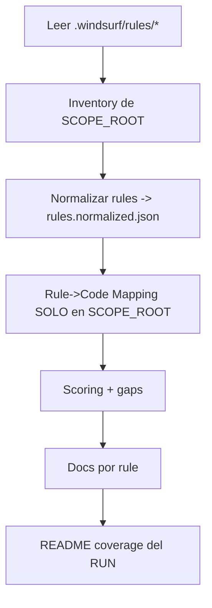

# WF-RULES-REVIEW — Auditoría de implementación de Rules (Windsurf) + Skills (Scope por Folder)

> **Fuente de verdad de rules (Windsurf):** `.windsurf/rules/*`  
> **Objetivo:** auditar **un folder específico** (scope) contra el set de **rules** y generar **1 archivo por rule** en `docs/rules-review/` con evidencia, score y plan de mejora, **indicando qué Skill debe ejecutar cada tarea**.

---

## 0) Inputs del workflow (OBLIGATORIOS)

Este workflow **no corre sobre todo el repo por defecto**. Debes pasar inputs:

| Input           | Tipo                | Ejemplo              | Descripción                                      |
| --------------- | ------------------- | -------------------- | ------------------------------------------------ |
| `SCOPE_ROOT`    | string (path)       | `apps/auth-service`  | Carpeta base donde buscar evidencia.             |
| `SCOPE_DOMAINS` | lista opcional      | `auth,resources`     | Limita rules a dominios específicos (si aplica). |
| `RULE_FILTER`   | regex/glob opcional | `RULE-AUTH-*`        | Ejecuta solo un subconjunto de rules.            |
| `OUTPUT_ROOT`   | string (path)       | `docs/rules-review`  | Carpeta de salida (default).                     |
| `RUN_ID`        | string opcional     | `2026-02-15-auth-01` | Identificador del run (para trazabilidad).       |

### Reglas de scope

- **Solo** se busca evidencia dentro de `SCOPE_ROOT` (y subfolders).
- Se permite leer config global del repo (ej. `nx.json`, `package.json`) **solo** para mapear proyectos, pero **no** para buscar evidencia fuera de `SCOPE_ROOT`.

---

## 1) Skills disponibles (referencia rápida)

| Uso en el workflow                                                                 | Skill (name)                              | Skill ID                 |
| ---------------------------------------------------------------------------------- | ----------------------------------------- | ------------------------ |
| Preparación, ejecución local, CI/CD, observabilidad mínima del proceso             | `plataforma-build-deploy-operate-observe` | `SK-PLAT-OPS-001`        |
| Normalización/catálogo de rules y calidad de inventario                            | `gestion-datos-calidad`                   | `SK-DATA-OPS-001`        |
| Mapeo arquitectura/gobernanza (taxonomía por dominios, patrones)                   | `gobierno-de-arquitectura-diseno`         | `SK-ARCH-GOV-001`        |
| Inspección backend (controllers/handlers/repos/events) y evaluación CQRS/Hexagonal | `backend`                                 | `SK-BE-API-001`          |
| Evaluación NFRs (concurrencia, idempotencia, resiliencia)                          | `arquitectura-escalabilidad-resiliencia`  | `SK-SCALE-RES-001`       |
| Evaluación de pruebas, BDD Given-When-Then, gates de calidad                       | `qa-calidad`                              | `SK-QA-001`              |
| Hallazgos de seguridad, privacidad y cumplimiento (baseline)                       | `seguridad-privacidad-compliance`         | `SK-SEC-COMP-001`        |
| Hardening/controles extra (R2+/R3) cuando las rules lo exijan                      | `seguridad-avanzada`                      | `SK-SEC-ADV-001`         |
| Consolidación de resultados (tabla, KPIs de coverage)                              | `data-reporting`                          | `SK-DATA-001`            |
| Documentación operable + criterios de salida + plan de trabajo                     | `gestion-ingenieria-delivery`             | `SK-ENG-DELIVERY-001`    |
| Auditorías/certificaciones si las rules lo piden                                   | `cumplimiento-certificaciones`            | `SK-COMPLIANCE-CERT-001` |

---

## 2) Outputs (artefactos)

> Para soportar múltiples ejecuciones por folder, el workflow escribe por defecto en:
> `<OUTPUT_ROOT>/runs/<RUN_ID>/...`

```
docs/
  rules-review/
    runs/
      <RUN_ID>/
        README.md
        _inventory/
        _catalog/
        _evidence/
        RULE-<DOMAIN>-<RULE_ID>.md
```

---

## 3) Rubrica de nivel (Score 0–5)

- **0 — No evidencias**
- **1 — Esqueleto**
- **2 — Parcial**
- **3 — Funcional**
- **4 — Completo con pruebas**
- **5 — Production-grade**

**Gates**

- Sin tests ⇒ máximo **3**
- EDA sin idempotencia (si aplica) ⇒ máximo **3**
- `<=2` ⇒ bloqueante si es core

---

## 4) Flujo general (Mermaid)



---

# 5) Workflow paso a paso (con Skill por tarea y scope)

## Fase 0 — Preparación (inputs + carpetas + verificación rules)

### Tareas

1. Validar inputs (`SCOPE_ROOT` existe, `RUN_ID` definido).  
   **Skill:** `plataforma-build-deploy-operate-observe` (`SK-PLAT-OPS-001`)

2. Crear carpeta de salida del run:

```bash
mkdir -p <OUTPUT_ROOT>/runs/<RUN_ID>/{_inventory,_catalog,_evidence}
```

**Skill:** `plataforma-build-deploy-operate-observe` (`SK-PLAT-OPS-001`)

3. Verificar rules:

```bash
ls -la .windsurf/rules
```

**Skill:** `plataforma-build-deploy-operate-observe` (`SK-PLAT-OPS-001`)

---

## Fase 1 — Analizar folder (solo `SCOPE_ROOT`)

### Tareas

1. Inventario de `SCOPE_ROOT`: árbol, extensiones, tamaños, hotspots.  
   **Skill:** `plataforma-build-deploy-operate-observe` (`SK-PLAT-OPS-001`)  
   **Apoyo:** `gestion-datos-calidad` (`SK-DATA-OPS-001`)

2. Mapear el folder al dominio (y/o proyecto Nx si aplica).  
   **Skill:** `gobierno-de-arquitectura-diseno` (`SK-ARCH-GOV-001`)

### Artefactos

- `<OUTPUT_ROOT>/runs/<RUN_ID>/_inventory/folder-map.md`  
  **Skill:** `gestion-ingenieria-delivery` (`SK-ENG-DELIVERY-001`)
- `<OUTPUT_ROOT>/runs/<RUN_ID>/_inventory/file-stats.json`  
  **Skill:** `gestion-datos-calidad` (`SK-DATA-OPS-001`)

---

## Fase 2 — Catalogar y normalizar rules

### Tareas

1. Leer/parsear `.windsurf/rules/*`.  
   **Skill:** `gestion-datos-calidad` (`SK-DATA-OPS-001`)

2. Aplicar filtros:

- si `SCOPE_DOMAINS` está definido ⇒ incluir solo esos dominios
- si `RULE_FILTER` está definido ⇒ incluir solo IDs que matcheen

  **Skill:** `gobierno-de-arquitectura-diseno` (`SK-ARCH-GOV-001`)

### Artefactos

- `<OUTPUT_ROOT>/runs/<RUN_ID>/_catalog/rules.normalized.json`  
  **Skill:** `gestion-datos-calidad` (`SK-DATA-OPS-001`)
- `<OUTPUT_ROOT>/runs/<RUN_ID>/_catalog/rules.index.md`  
  **Skill:** `gestion-ingenieria-delivery` (`SK-ENG-DELIVERY-001`)

---

## Fase 3 — Rule vs Code (evidencia SOLO dentro de `SCOPE_ROOT`)

### Tareas

1. Buscar evidencia por rule **restringida a `SCOPE_ROOT`**:

- controllers/handlers/domain/repos/events/tests
- CQRS/Hex/EDA patterns
- tests `*.spec.ts` `*.e2e-spec.ts`  
   **Skill:** `backend` (`SK-BE-API-001`)

2. Validar coherencia arquitectónica (ports/adapters, commands/queries, events).  
   **Skill:** `gobierno-de-arquitectura-diseno` (`SK-ARCH-GOV-001`)

3. Detectar NFRs aplicables (idempotencia, resiliencia, DLQ, retries) **si existen dentro de `SCOPE_ROOT`**.  
   **Skill:** `arquitectura-escalabilidad-resiliencia` (`SK-SCALE-RES-001`)

### Artefacto por rule

- `<OUTPUT_ROOT>/runs/<RUN_ID>/_evidence/<RULE_ID>.json`  
  **Skill:** `backend` (`SK-BE-API-001`)

> Regla crítica: no inventar paths. Todo path debe estar dentro de `SCOPE_ROOT`.

---

## Fase 4 — Scoring + Gap Analysis

### Tareas

1. Gap funcional vs ACs.  
   **Skill:** `backend` (`SK-BE-API-001`)

2. Gap de pruebas (BDD).  
   **Skill:** `qa-calidad` (`SK-QA-001`)

3. Gap arquitectónico.  
   **Skill:** `gobierno-de-arquitectura-diseno` (`SK-ARCH-GOV-001`)

4. Gap resiliencia/concurrencia/idempotencia.  
   **Skill:** `arquitectura-escalabilidad-resiliencia` (`SK-SCALE-RES-001`)

5. Gap observabilidad mínima (logs/trazas) si está en el scope.  
   **Skill:** `plataforma-build-deploy-operate-observe` (`SK-PLAT-OPS-001`)

6. Gap seguridad/compliance (si la rule aplica).  
   **Skill:** `seguridad-privacidad-compliance` (`SK-SEC-COMP-001`)  
   **Escalamiento:** `seguridad-avanzada` (`SK-SEC-ADV-001`)

---

## Fase 5 — Generar 1 archivo por rule

Crear: `<OUTPUT_ROOT>/runs/<RUN_ID>/RULE-<DOMAIN>-<RULE_ID>.md`

### Tareas

- Redactar por rule (resumen, evidencia, gaps, plan por capas, tests BDD, DoD).  
  **Skill:** `gestion-ingenieria-delivery` (`SK-ENG-DELIVERY-001`)  
  **Apoyo:** `qa-calidad` (`SK-QA-001`)

---

## Fase 6 — README del run (coverage)

Generar `<OUTPUT_ROOT>/runs/<RUN_ID>/README.md`

### Tareas

1. Tabla de coverage + KPIs (por dominio/score).  
   **Skill:** `data-reporting` (`SK-DATA-001`)

2. Resumen ejecutivo y top gaps.  
   **Skill:** `gestion-ingenieria-delivery` (`SK-ENG-DELIVERY-001`)

---

# 6) Prompt listo para ejecutar en Windsurf (con inputs)

Copia y pega, y **reemplaza** valores:

```text
Inputs:
- SCOPE_ROOT=<apps/auth-service>
- SCOPE_DOMAINS=<auth>                # opcional (csv)
- RULE_FILTER=<RULE-AUTH-*>           # opcional (glob/regex)
- OUTPUT_ROOT=<docs/rules-review>     # opcional
- RUN_ID=<2026-02-15-auth-01>

Objetivo: Ejecuta WF-RULES-REVIEW con scope SOLO en SCOPE_ROOT.

Fase 0 (SK-PLAT-OPS-001):
1) Valida que SCOPE_ROOT exista y crea OUTPUT_ROOT/runs/RUN_ID/*.
2) Verifica .windsurf/rules/*.

Fase 1 (SK-PLAT-OPS-001 + SK-DATA-OPS-001 + SK-ARCH-GOV-001):
3) Genera inventario SOLO de SCOPE_ROOT: folder-map.md + file-stats.json.
4) Mapea el folder a dominio/proyecto.

Fase 2 (SK-DATA-OPS-001 + SK-ARCH-GOV-001):
5) Parse y normaliza rules desde .windsurf/rules/*, aplicando SCOPE_DOMAINS y RULE_FILTER.
6) Escribe rules.normalized.json + rules.index.md.

Fase 3 (SK-BE-API-001 + SK-ARCH-GOV-001 + SK-SCALE-RES-001):
7) Por cada rule del catálogo: recolecta evidencia SOLO dentro de SCOPE_ROOT y escribe _evidence/<RULE_ID>.json.

Fase 4 (SK-QA-001 + SK-SEC-COMP-001 + SK-PLAT-OPS-001 + SK-SCALE-RES-001 + SK-ARCH-GOV-001 + SK-BE-API-001):
8) Asigna score 0..5 y gaps por categorías.

Fase 5 (SK-ENG-DELIVERY-001 + SK-QA-001):
9) Genera RULE-<DOMAIN>-<RULE_ID>.md por cada rule.

Fase 6 (SK-DATA-001 + SK-ENG-DELIVERY-001):
10) Genera README.md del run con tabla de cobertura y resumen.

Reglas:
- La evidencia debe estar dentro de SCOPE_ROOT.
- No inventes paths/archivos.
- Si domain no es explícito: infiere y marca ⚠️.
- Mantén consistencia de scoring con gates.
```

---

## 7) Ejemplos rápidos

### A) Auditar solo auth-service

- `SCOPE_ROOT=apps/auth-service`
- `SCOPE_DOMAINS=auth`
- `RULE_FILTER=RULE-AUTH-*`
- `RUN_ID=2026-02-15-auth-01`

### B) Auditar solo un lib compartido

- `SCOPE_ROOT=libs/shared/security`
- `RULE_FILTER=RULE-SEC-*`
- `RUN_ID=2026-02-15-sec-lib-01`

---

## 8) Notas de consistencia

- **Si una rule requiere cross-service** (p.ej. outbox, integración EDA): el workflow debe documentar que el scope es insuficiente y marcar gap como “requiere evidencia fuera de scope”.
- **Evitar alucinación:** si no existe evidencia en scope, declarar “No encontrada” y asignar score 0–1.
